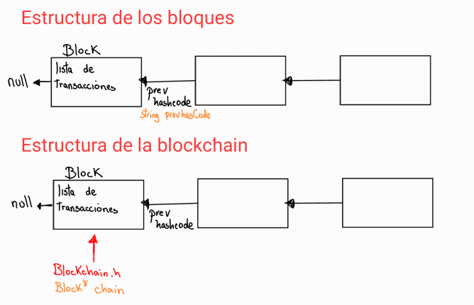

# BlockChain Project 
__CS2023 - Algoritmos y Estructuras de datos__

### Integrantes:
- Gabriel Enrique Espinoza Hernández
- Kevin Abraham Huaman Vega
- Paolo Vásquez Grahammer 

_Profesor a cargo_: Heider Sanchez

## Fundamento del proyecto
El proyecto consiste en desarrollar una aplicación transaccional de interacción de datos teniendo
como base de seguridad una estructura de datos de cadena de bloques (Blockchains en un solo
host). 

### Caso de estudio
En la primera década del siglo XXI emergen dos acontecimientos que serán considerados como hitos de 
la historia económica reciente debido a su importancia e impacto en la configuración del nuevo 
panorama económico mundial. Estos dos fenómenos son: la crisis económica y financiera de 
2008-2009; y la invención de la moneda electrónica, Bitcoin, basada en la creación de la 
tecnología conocida como cadena de bloques (blockchain), la infraestructura que soporta y respalda 
la criptomoneda, con la particularidad de ser un sistema de igual a igual (peer-to-peer), por lo
que no requiere la intermediación de terceros para su operación.

La crisis económica y financiera mundial de 2008-2009 surgió como un fenómeno local en el 
mercado hipotecario de la economía de Estados Unidos, para luego extenderse pro el mundo y llevar 
a la quiebra de grandes bancos de inversión (Lehman Brothers), dejando en “jaque” a Wall Street 
y al sistema de pagos internacional.

La intervención directa del gobierno estadounidense, a través del Banco de la Reserva Federal 
como prestamista de última instancia, así como la inyección de liquidez para restablecer el 
funcionamiento del sistema bancario dan cuenta de la magnitud de aquel fenómeno.

El impacto negativo de esta crisis en el crecimiento y los niveles de la producción, el ingreso, 
el empleo y la productividad ha propiciado una mayor desigualdad a escala global. 
La debilidad y prolongación de la recuperación económica, aunadas a la incertidumbre en las 
previsiones del crecimiento ha propiciado un debate inacabado entre los economistas. La discusión 
tiene varias aristas, entre las que sobresalen la necesidad de diseñar una nueva arquitectura del 
sistema financiero internacional, con un esquema regulatorio más sólido y transparente; así como 
la discusión sobre el potencial de las tecnologías digitales como “factor clave” para la recuperación
del crecimiento de la economía, entre otros temas.

En este contexto, se busca crear una nueva alternativa al sistema financiero internacional por medio de
la tecnología. Una blockchain que soporte una criptomoneda que no tiene grado de intervención de instituciones,
buscando la solidez, fiabilidad y transparencia que un problema de estas características requiere. 

Se implementó una blockchain similar a la de una criptomoneda para hacer transacciones monetarias, 
buscando la securidad y confidencialidad de las transacciones realizadas, pero a su vez dando 
la posibilidad de alterarlas (por requisito del proyecto). 

### Importancia del Blockchain en el dominio de datos elegido

Dado que se trata de transacciones monetarias, la seguridad e inmutabilidad de las mismas es fundamental
para mantener un sistema de estas características. La blockain asegura estos requerimientos. 
Si bien las transacciones son públicas, se necesita aplicar cierta fuerza para poder obtener 
generar nuevas transacciones, y más fuerza para modificarlas. 
Esto beneficia en que, mientras más robusta sea la blockhain, mayor será la fuerza necesaria para 
modificar los datos contenidos en ella, lo que desinsentiva el hacerlo. 

### Estructura de datos del Blockchain y la estrategia para asegurar la integridad de su contenido.
Para almacenar, dar seguridad y a la vez serializar las transacciones, se optó por registrar las mismas
en bloques y unirlos.
Dado que cada bloque hace referencia a al bloque anterior en el campo llamado "Prev" o bloque padre, 
se optó por estructurar la blockhain en forma de __Forward List__, de tal manera que se cumpla la 
particularidad requerida, siendo cada bloque de la blockhain un nodo de la estructura.

Para asegurar la integridad de los datos, se aplicó el algoritmo SHA256 sobre la concatenación 
de los datos que conforman el bloque, los cuales contienen la fecha, el emisor, el receptor y el 
monto. Para dificultar aún más su alteración se optó por forzar que el hashcode generado 
para que un bloque sea aceptado  empiece con 4 ceros consecutivos, de modo que de no hacerlo se reace 
el hashcode. 

Al crear y modificar un bloque, debe aplicarse lo anteriormente mencionado. Además, al modificar la información
de un bloque, el hashcode de todos los bloques que le secundan, llamados también los nodos hijos, deben volverse a calcular. Por último,
el utilizar un foward list para representar la blockain, de querer acceder o modificar la información
de los bloques más lejanos, se debe hacer un recorrido a lo largo de la estructura, de modo que 
tardará más en función a su posición.

Por otro lado, information puede ser accedida y visualizarse de 5 maneras diferentes como se logra ver en las siguientes imágenes.

### Bibliografía

Dev Tech Guy. Cryptocurrency (Bitcoin, Ethereum, Ripple) Blockchain in 30 minutes in C++! (Part 1). Extraído de: https://youtu.be/2VDQeQfh4Hs. Recuperado el 03/10/2022.

Porat, A; Pratap, A; Shah, P; Adkar, V. Blockchain Consensus: An analysis of
Proof-of-Work and its applications. Stanford University. Extraído de: https://www.scs.stanford.edu/17au-cs244b/labs/projects/porat_pratap_shah_adkar.pdf. Recopilado el 03/10/22 

Java T Point. (s/f.). Blockchain Proof of work. Extraído de: https://www.javatpoint.com/blockchain-proof-of-work#:~:text=Proof%20of%20work%20can%20be%20implemented%20in%20a%20blockchain%20by,for%20making%20the%20block%20valid. Recuperado el 03/10/22.

OpenSSL. (s/f.). Cripto. Extraído de: https://www.openssl.org/docs/man3.0/man7/crypto.html. Recopilado el 03/10/22.

Arora, S. (Septiembre, 22). What Is Bitcoin Mining: How Does it Work, Proof of Work, Mining Hardware and More. SimpliLearn. Extraído de: https://www.simplilearn.com/bitcoin-mining-explained-article. Recuperado el 04/10/22.